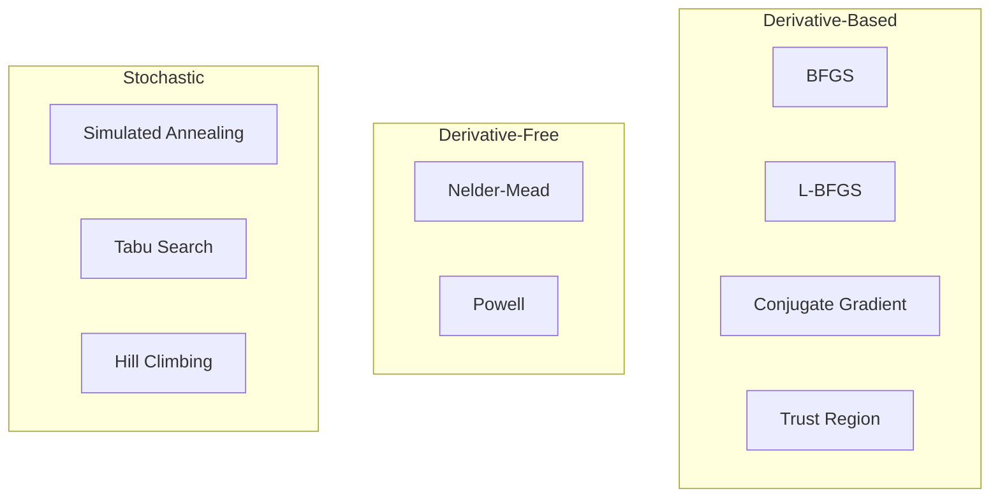

# Classical Optimization Methods

Classical optimization methods are well-established mathematical techniques that have been used for decades. They include both derivative-based methods and derivative-free approaches.

## Overview

| Property | Value |
|----------|-------|
| **Category** | Mathematical Optimization |
| **Algorithms** | 9 |
| **Best For** | Smooth objectives, local search |
| **Convergence** | Typically fast, may find local optima |

## Algorithm List

### BFGS (Broyden–Fletcher–Goldfarb–Shanno)

A quasi-Newton method that approximates the inverse Hessian matrix.

```python
from opt.classical import BFGS

optimizer = BFGS(
    func=objective,
    lower_bound=-5,
    upper_bound=5,
    dim=10,
    num_restarts=10,
    max_iter=500,
)
```

### L-BFGS (Limited-memory BFGS)

Memory-efficient version of BFGS for large-scale optimization.

```python
from opt.classical import LBFGS

optimizer = LBFGS(
    func=objective,
    lower_bound=-5,
    upper_bound=5,
    dim=100,  # Works well with high dimensions
    max_iter=500,
)
```

### Nelder-Mead (Simplex Method)

A derivative-free method using a simplex of n+1 points.

```python
from opt.classical import NelderMead

optimizer = NelderMead(
    func=objective,
    lower_bound=-5,
    upper_bound=5,
    dim=10,
    max_iter=500,
)
```

### Simulated Annealing

A probabilistic technique inspired by annealing in metallurgy.

```python
from opt.classical import SimulatedAnnealing

optimizer = SimulatedAnnealing(
    func=objective,
    lower_bound=-5,
    upper_bound=5,
    dim=10,
    max_iter=1000,
    initial_temp=1000,
    cooling_rate=0.99,
)
```

### Complete Algorithm List

| Algorithm | Type | Module |
|-----------|------|--------|
| BFGS | Quasi-Newton | `bfgs` |
| Conjugate Gradient | Gradient-based | `conjugate_gradient` |
| Hill Climbing | Local search | `hill_climbing` |
| L-BFGS | Quasi-Newton (memory-efficient) | `lbfgs` |
| Nelder-Mead | Simplex (derivative-free) | `nelder_mead` |
| Powell's Method | Conjugate direction | `powell` |
| Simulated Annealing | Probabilistic | `simulated_annealing` |
| Tabu Search | Memory-based | `tabu_search` |
| Trust Region | Model-based | `trust_region` |

## Key Concepts

### Quasi-Newton Methods

Quasi-Newton methods approximate the Hessian matrix (or its inverse) iteratively:

$$
H_{k+1} = H_k + \Delta H_k
$$

The BFGS update formula:

$$
H_{k+1} = \left(I - \frac{s_k y_k^T}{y_k^T s_k}\right) H_k \left(I - \frac{y_k s_k^T}{y_k^T s_k}\right) + \frac{s_k s_k^T}{y_k^T s_k}
$$

### Simulated Annealing

Acceptance probability in simulated annealing:

$$
P(\Delta E) = \begin{cases}
1 & \text{if } \Delta E < 0 \\
e^{-\Delta E / T} & \text{if } \Delta E \geq 0
\end{cases}
$$

Where $T$ is the temperature parameter that decreases over time.

### Method Comparison



## Usage Example

```python
from opt.classical import (
    BFGS,
    NelderMead,
    SimulatedAnnealing,
    TrustRegion,
)
from opt.benchmark.functions import rosenbrock

# Compare classical methods
methods = {
    "BFGS": BFGS,
    "Nelder-Mead": NelderMead,
    "Simulated Annealing": SimulatedAnnealing,
    "Trust Region": TrustRegion,
}

for name, MethodClass in methods.items():
    optimizer = MethodClass(
        func=rosenbrock,
        lower_bound=-5,
        upper_bound=5,
        dim=10,
        max_iter=500,
    )
    _, fitness = optimizer.search()
    print(f"{name}: {fitness:.6e}")
```

## See Also

- [API Reference: Classical](../api/classical.md)
- [Benchmark Results](../benchmarks/results.md)
