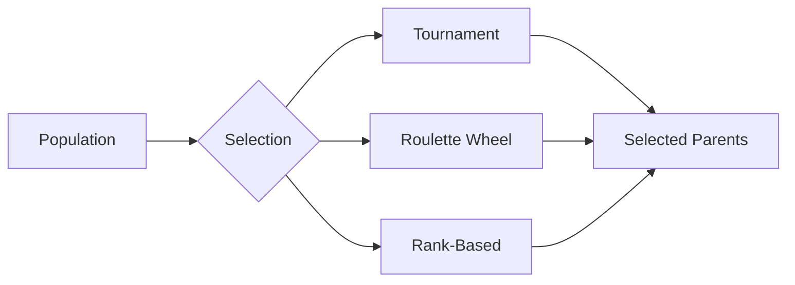
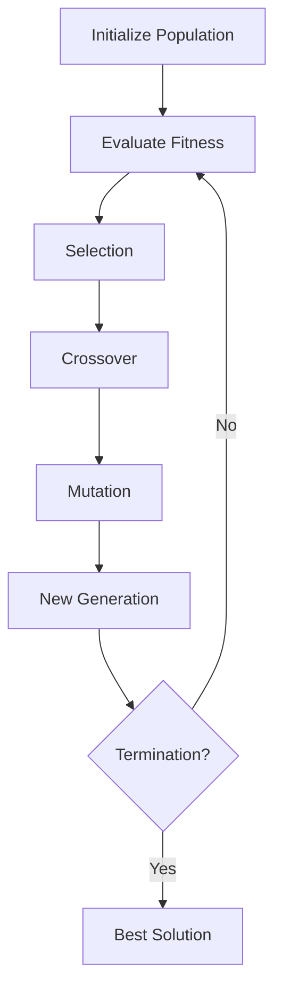

# Evolutionary Algorithms

Evolutionary algorithms are population-based metaheuristic optimization algorithms that use mechanisms inspired by biological evolution, such as reproduction, mutation, recombination, and selection.

## Overview

| Property | Value |
|----------|-------|
| **Category** | Population-Based |
| **Algorithms** | 6 |
| **Best For** | Global optimization, complex fitness landscapes |
| **Typical Population Size** | 50-200 |

## Algorithm List

### Genetic Algorithm (GA)

The classic evolutionary algorithm inspired by Darwin's theory of natural selection.

```python
from opt.evolutionary import GeneticAlgorithm

optimizer = GeneticAlgorithm(
    func=objective,
    lower_bound=-5,
    upper_bound=5,
    dim=10,
    population_size=100,
    max_iter=500,
    mutation_rate=0.1,
    crossover_rate=0.8,
)
```

### Differential Evolution (DE)

A powerful evolutionary algorithm that uses difference vectors for mutation.

```python
from opt.evolutionary import DifferentialEvolution

optimizer = DifferentialEvolution(
    func=objective,
    lower_bound=-5,
    upper_bound=5,
    dim=10,
    population_size=50,
    max_iter=500,
    F=0.8,   # Mutation factor
    CR=0.9,  # Crossover rate
)
```

### CMA-ES (Covariance Matrix Adaptation Evolution Strategy)

State-of-the-art evolutionary strategy for continuous optimization.

```python
from opt.evolutionary import CMAES

optimizer = CMAES(
    func=objective,
    lower_bound=-5,
    upper_bound=5,
    dim=10,
    population_size=50,
    max_iter=500,
    sigma=1.0,  # Initial step size
)
```

### Complete Algorithm List

| Algorithm | Description | Module |
|-----------|-------------|--------|
| CMA-ES | Covariance Matrix Adaptation Evolution Strategy | `cma_es` |
| Cultural Algorithm | Evolution with cultural knowledge | `cultural_algorithm` |
| Differential Evolution | Uses difference vectors for mutation | `differential_evolution` |
| EDA | Estimation of Distribution Algorithm | `estimation_of_distribution_algorithm` |
| Genetic Algorithm | Classic evolutionary algorithm | `genetic_algorithm` |
| Imperialist Competitive Algorithm | Based on imperialistic competition | `imperialist_competitive_algorithm` |

## Key Concepts

### Selection Methods



### Evolution Cycle



## Usage Example

```python
from opt.evolutionary import (
    GeneticAlgorithm,
    DifferentialEvolution,
    CMAES,
)
from opt.benchmark.functions import rosenbrock

# Compare evolutionary algorithms
algorithms = {
    "GA": GeneticAlgorithm,
    "DE": DifferentialEvolution,
    "CMA-ES": CMAES,
}

for name, AlgClass in algorithms.items():
    optimizer = AlgClass(
        func=rosenbrock,
        lower_bound=-5,
        upper_bound=5,
        dim=10,
        max_iter=500,
    )
    _, fitness = optimizer.search()
    print(f"{name}: {fitness:.6e}")
```

## See Also

- [API Reference: Evolutionary](../api/evolutionary.md)
- [Benchmark Results](../benchmarks/results.md)
