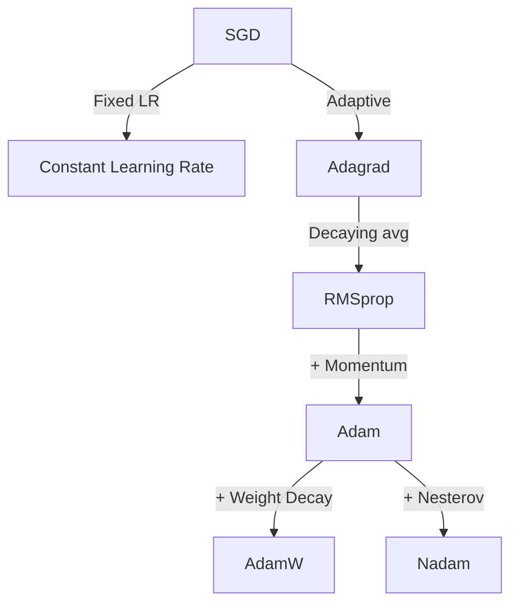

# Gradient-Based Algorithms

Gradient-based optimization algorithms use gradient information (first-order derivatives) to guide the search toward optimal solutions. These methods are fundamental in machine learning and deep learning.

## Overview

| Property | Value |
|----------|-------|
| **Category** | First-Order Methods |
| **Algorithms** | 11 |
| **Best For** | Smooth, differentiable objectives |
| **Convergence** | Fast on convex problems |

## Algorithm List

### Adam (Adaptive Moment Estimation)

Combines advantages of AdaGrad and RMSProp with bias correction.

```python
from opt.gradient_based import AdaptiveMomentEstimation

optimizer = AdaptiveMomentEstimation(
    func=objective,
    lower_bound=-5,
    upper_bound=5,
    dim=10,
    learning_rate=0.001,
    beta1=0.9,
    beta2=0.999,
    max_iter=1000,
)
```

### AdamW (Adam with Weight Decay)

Adam with decoupled weight decay for better regularization.

```python
from opt.gradient_based import AdamW

optimizer = AdamW(
    func=objective,
    lower_bound=-5,
    upper_bound=5,
    dim=10,
    learning_rate=0.001,
    weight_decay=0.01,
    max_iter=1000,
)
```

### SGD with Momentum

Stochastic Gradient Descent enhanced with momentum for faster convergence.

```python
from opt.gradient_based import SGDMomentum

optimizer = SGDMomentum(
    func=objective,
    lower_bound=-5,
    upper_bound=5,
    dim=10,
    learning_rate=0.01,
    momentum=0.9,
    max_iter=1000,
)
```

### Complete Algorithm List

| Algorithm | Description | Module |
|-----------|-------------|--------|
| Adadelta | Adaptive learning rate (no learning rate parameter) | `adadelta` |
| Adagrad | Per-parameter adaptive learning rate | `adagrad` |
| AdaMax | Adam variant with infinity norm | `adamax` |
| AdamW | Adam with decoupled weight decay | `adamw` |
| Adam | Adaptive Moment Estimation | `adaptive_moment_estimation` |
| AMSGrad | Adam with non-decreasing second moment | `amsgrad` |
| Nadam | Nesterov-accelerated Adam | `nadam` |
| NAG | Nesterov Accelerated Gradient | `nesterov_accelerated_gradient` |
| RMSprop | Root Mean Square Propagation | `rmsprop` |
| SGD + Momentum | SGD with momentum | `sgd_momentum` |
| SGD | Stochastic Gradient Descent | `stochastic_gradient_descent` |

## Key Concepts

### Gradient Descent Update

The basic update rule for gradient descent is:

$$
\theta_{t+1} = \theta_t - \eta \nabla f(\theta_t)
$$

Where:

- $\theta_t$ is the parameter at step $t$
- $\eta$ is the learning rate
- $\nabla f(\theta_t)$ is the gradient

### Adam Update Rules

Adam combines momentum and adaptive learning rates:

$$
m_t = \beta_1 m_{t-1} + (1 - \beta_1) g_t
$$

$$
v_t = \beta_2 v_{t-1} + (1 - \beta_2) g_t^2
$$

$$
\hat{m}_t = \frac{m_t}{1 - \beta_1^t}, \quad \hat{v}_t = \frac{v_t}{1 - \beta_2^t}
$$

$$
\theta_{t+1} = \theta_t - \frac{\eta}{\sqrt{\hat{v}_t} + \epsilon} \hat{m}_t
$$

### Learning Rate Comparison



## Usage Example

```python
from opt.gradient_based import (
    AdamW,
    SGDMomentum,
    RMSprop,
    Adagrad,
)
from opt.benchmark.functions import rosenbrock

# Compare gradient-based optimizers
optimizers = {
    "AdamW": AdamW,
    "SGD+Momentum": SGDMomentum,
    "RMSprop": RMSprop,
    "Adagrad": Adagrad,
}

for name, OptClass in optimizers.items():
    optimizer = OptClass(
        func=rosenbrock,
        lower_bound=-5,
        upper_bound=5,
        dim=10,
        max_iter=1000,
    )
    _, fitness = optimizer.search()
    print(f"{name}: {fitness:.6e}")
```

## See Also

- [API Reference: Gradient-Based](../api/gradient-based.md)
- [Benchmark Results](../benchmarks/results.md)
