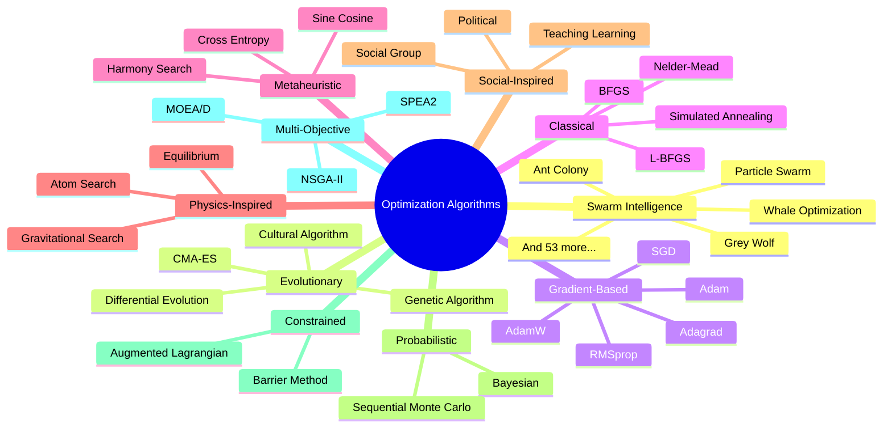
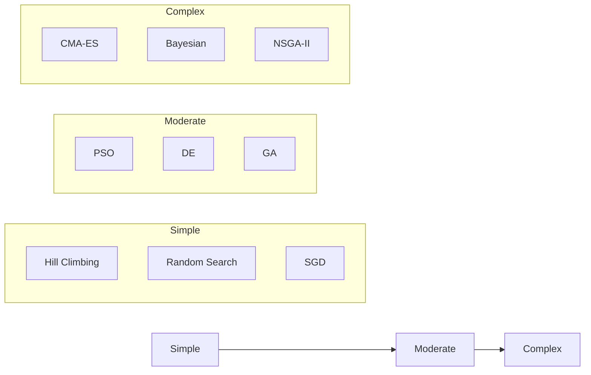

# Algorithm Overview

Useful Optimizer provides a comprehensive collection of optimization algorithms organized into logical categories. This page provides an overview of all available algorithm categories.

## Algorithm Categories

## Category Details

### :material-bee: [Swarm Intelligence](swarm-intelligence.md)

**57 algorithms** inspired by collective behavior of natural swarms.

These algorithms mimic the social behavior of birds, fish, insects, and other animals that exhibit collective intelligence. They are particularly effective for global optimization problems.

**Key Algorithms:**

- Particle Swarm Optimization (PSO)
- Ant Colony Optimization (ACO)
- Grey Wolf Optimizer (GWO)
- Whale Optimization Algorithm (WOA)
- Firefly Algorithm

---

### :material-dna: [Evolutionary](evolutionary.md)

**6 algorithms** based on biological evolution principles.

These algorithms use mechanisms inspired by biological evolution such as selection, crossover, and mutation to evolve a population of candidate solutions.

**Key Algorithms:**

- Genetic Algorithm (GA)
- Differential Evolution (DE)
- CMA-ES
- Cultural Algorithm

---

### :material-function-variant: [Gradient-Based](gradient-based.md)

**11 algorithms** using gradient information for optimization.

These algorithms compute or estimate gradients of the objective function to guide the search towards optima. They are commonly used in machine learning.

**Key Algorithms:**

- Adam / AdamW
- SGD with Momentum
- RMSprop
- Adagrad / Adadelta
- Nadam

---

### :material-target: [Classical](classical.md)

**9 algorithms** representing traditional optimization methods.

Well-established optimization techniques that have been used for decades in mathematical optimization.

**Key Algorithms:**

- BFGS / L-BFGS
- Nelder-Mead Simplex
- Conjugate Gradient
- Simulated Annealing
- Tabu Search

---

### :material-lightbulb: [Metaheuristic](metaheuristic.md)

**14 algorithms** providing high-level problem-solving strategies.

These algorithms are problem-independent frameworks that can be applied to a wide variety of optimization problems.

**Key Algorithms:**

- Harmony Search
- Cross Entropy Method
- Sine Cosine Algorithm
- Variable Neighbourhood Search
- Stochastic Fractal Search

---

### :material-atom: [Physics-Inspired](physics-inspired.md)

**4 algorithms** based on physical phenomena.

These algorithms simulate physical processes and laws to guide the optimization search.

**Key Algorithms:**

- Gravitational Search Algorithm
- Equilibrium Optimizer
- Atom Search Optimization
- RIME Optimizer

---

### :material-account-group: [Social-Inspired](social-inspired.md)

**4 algorithms** based on social behavior patterns.

These algorithms model human social interactions and group dynamics.

**Key Algorithms:**

- Social Group Optimization
- Teaching-Learning-Based Optimization
- Political Optimizer
- Soccer League Optimization

---

### :material-chart-bell-curve: [Probabilistic](probabilistic.md)

**5 algorithms** using probabilistic models.

These algorithms use probability distributions and statistical methods to guide the search.

**Key Algorithms:**

- Bayesian Optimization
- Sequential Monte Carlo
- Adaptive Metropolis
- Parzen Tree Estimator

---

### :material-lock: [Constrained](constrained.md)

**5 algorithms** for constrained optimization problems.

Specialized methods for problems with equality and inequality constraints.

**Key Algorithms:**

- Augmented Lagrangian Method
- Barrier Method
- Penalty Method
- Sequential Quadratic Programming
- Successive Linear Programming

---

### :material-arrow-split-vertical: [Multi-Objective](multi-objective.md)

**4 algorithms** for multi-objective optimization.

Algorithms that handle problems with multiple, often conflicting, objectives.

**Key Algorithms:**

- NSGA-II
- MOEA/D
- SPEA2

---

## Choosing the Right Algorithm

| Problem Type | Recommended Algorithms |
|--------------|----------------------|
| Continuous, low-dimensional | BFGS, L-BFGS, Nelder-Mead |
| Continuous, high-dimensional | CMA-ES, DE, PSO |
| Highly multimodal | DE, GA, Grey Wolf |
| Expensive evaluations | Bayesian Optimization |
| Noisy objective | PSO, DE, CMA-ES |
| Constrained | Augmented Lagrangian, Barrier |
| Multi-objective | NSGA-II, MOEA/D |
| Discrete/combinatorial | Ant Colony, Genetic Algorithm |

## Algorithm Complexity

## Next Steps

- Browse specific algorithm categories in the sidebar
- View [benchmark comparisons](../benchmarks/index.md)
- Check the [API Reference](../api/index.md) for implementation details
