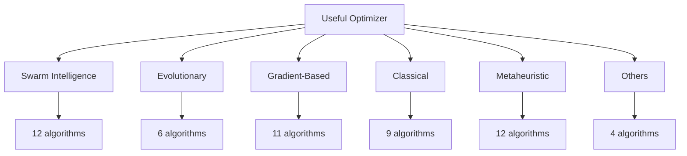

# Algorithms

Useful Optimizer provides **58 optimization algorithms** organized into logical categories. Each algorithm is designed to solve numeric optimization problems with a consistent, easy-to-use API.

---

## Algorithm Taxonomy



---

## Categories

<div class="grid cards" markdown>

-   :material-bird:{ .lg .middle } **Swarm Intelligence**

    ---

    Algorithms inspired by collective behavior of social organisms.

    <span class="algorithm-badge algorithm-badge--swarm">12 algorithms</span>

    [:octicons-arrow-right-24: View All](swarm-intelligence/index.md)

-   :material-dna:{ .lg .middle } **Evolutionary**

    ---

    Population-based algorithms using principles of natural evolution.

    <span class="algorithm-badge algorithm-badge--evolutionary">6 algorithms</span>

    [:octicons-arrow-right-24: View All](evolutionary/index.md)

-   :material-gradient-horizontal:{ .lg .middle } **Gradient-Based**

    ---

    Algorithms using derivative information for optimization.

    <span class="algorithm-badge algorithm-badge--gradient">11 algorithms</span>

    [:octicons-arrow-right-24: View All](gradient-based/index.md)

-   :material-target:{ .lg .middle } **Classical**

    ---

    Traditional optimization methods and local search techniques.

    <span class="algorithm-badge algorithm-badge--classical">9 algorithms</span>

    [:octicons-arrow-right-24: View All](classical/index.md)

-   :material-lightning-bolt:{ .lg .middle } **Metaheuristic**

    ---

    High-level problem-independent algorithmic frameworks.

    <span class="algorithm-badge algorithm-badge--metaheuristic">12 algorithms</span>

    [:octicons-arrow-right-24: View All](metaheuristic/index.md)

-   :material-puzzle:{ .lg .middle } **Others**

    ---

    Constrained optimization and probabilistic methods.

    <span class="algorithm-badge">4 algorithms</span>

    [:octicons-arrow-right-24: View All](physics-inspired/index.md)

</div>

---

## Complete Algorithm List

### Swarm Intelligence (12)

| Algorithm | Description | Complexity |
|-----------|-------------|------------|
| [**Particle Swarm**](swarm-intelligence/particle-swarm.md) | Bird flocking behavior | \(O(n \cdot p \cdot t)\) |
| [**Ant Colony**](swarm-intelligence/ant-colony.md) | Ant foraging with pheromone trails | \(O(n \cdot m \cdot t)\) |
| **Bat Algorithm** | Echolocation of microbats | \(O(n \cdot p \cdot t)\) |
| **Bee Algorithm** | Honey bee food foraging | \(O(n \cdot p \cdot t)\) |
| **Cat Swarm** | Seeking and tracing behavior of cats | \(O(n \cdot p \cdot t)\) |
| **Cuckoo Search** | Brood parasitism of cuckoos | \(O(n \cdot p \cdot t)\) |
| **Firefly Algorithm** | Flashing behavior of fireflies | \(O(n \cdot p^2 \cdot t)\) |
| **Fish Swarm** | Fish schooling behavior | \(O(n \cdot p \cdot t)\) |
| **Glowworm Swarm** | Glowworm luminescence | \(O(n \cdot p^2 \cdot t)\) |
| **Grey Wolf** | Wolf pack hunting hierarchy | \(O(n \cdot p \cdot t)\) |
| **Squirrel Search** | Squirrel foraging patterns | \(O(n \cdot p \cdot t)\) |
| **Whale Optimization** | Humpback whale hunting | \(O(n \cdot p \cdot t)\) |

### Evolutionary (6)

| Algorithm | Description | Complexity |
|-----------|-------------|------------|
| **CMA-ES** | Covariance matrix adaptation | \(O(n^3 + n^2 \cdot p)\) |
| **Cultural Algorithm** | Cultural evolution | \(O(n \cdot p \cdot t)\) |
| **Differential Evolution** | Differential mutation | \(O(n \cdot p \cdot t)\) |
| **EDA** | Probabilistic model building | \(O(n^2 \cdot p)\) |
| **Genetic Algorithm** | Natural selection | \(O(n \cdot p \cdot t)\) |
| **Imperialist Competitive** | Imperialistic competition | \(O(n \cdot p \cdot t)\) |

### Gradient-Based (11)

| Algorithm | Description | Complexity |
|-----------|-------------|------------|
| **Adadelta** | Adaptive learning rates | \(O(n \cdot t)\) |
| **Adagrad** | Per-parameter learning rates | \(O(n \cdot t)\) |
| **Adam** | Adaptive moment estimation | \(O(n \cdot t)\) |
| **AdaMax** | Adam with infinity norm | \(O(n \cdot t)\) |
| **AdamW** | Adam with weight decay | \(O(n \cdot t)\) |
| **AMSGrad** | Non-decreasing second moments | \(O(n \cdot t)\) |
| **Nadam** | Nesterov + Adam | \(O(n \cdot t)\) |
| **Nesterov** | Accelerated gradient | \(O(n \cdot t)\) |
| **RMSprop** | Root mean square propagation | \(O(n \cdot t)\) |
| **SGD Momentum** | SGD with momentum | \(O(n \cdot t)\) |
| **SGD** | Stochastic gradient descent | \(O(n \cdot t)\) |

### Classical (9)

| Algorithm | Description | Complexity |
|-----------|-------------|------------|
| **BFGS** | Quasi-Newton method | \(O(n^2 \cdot t)\) |
| **Conjugate Gradient** | Conjugate direction method | \(O(n \cdot t)\) |
| **Hill Climbing** | Local search | \(O(n \cdot t)\) |
| **L-BFGS** | Limited-memory BFGS | \(O(n \cdot m \cdot t)\) |
| **Nelder-Mead** | Simplex method | \(O(n^2 \cdot t)\) |
| **Powell** | Direction set method | \(O(n^2 \cdot t)\) |
| **Simulated Annealing** | Metallurgical annealing | \(O(n \cdot t)\) |
| **Tabu Search** | Memory-based search | \(O(n \cdot t)\) |
| **Trust Region** | Model-based optimization | \(O(n^3 \cdot t)\) |

### Metaheuristic (12)

| Algorithm | Description | Complexity |
|-----------|-------------|------------|
| **Colliding Bodies** | Collision physics | \(O(n \cdot p \cdot t)\) |
| **Cross Entropy** | Importance sampling | \(O(n \cdot p \cdot t)\) |
| **Eagle Strategy** | Eagle hunting behavior | \(O(n \cdot p \cdot t)\) |
| **Harmony Search** | Musical improvisation | \(O(n \cdot p \cdot t)\) |
| **Particle Filter** | Sequential Monte Carlo | \(O(n \cdot p \cdot t)\) |
| **Shuffled Frog Leaping** | Frog memetic evolution | \(O(n \cdot p \cdot t)\) |
| **Sine Cosine** | Trigonometric functions | \(O(n \cdot p \cdot t)\) |
| **Stochastic Diffusion** | Diffusion processes | \(O(n \cdot p \cdot t)\) |
| **Stochastic Fractal** | Fractal patterns | \(O(n \cdot p \cdot t)\) |
| **Variable Depth** | Variable-depth search | \(O(n \cdot t)\) |
| **VNS** | Variable neighborhoods | \(O(n \cdot k \cdot t)\) |
| **VLSNS** | Very large neighborhoods | \(O(n \cdot t)\) |

---

## Choosing an Algorithm

!!! tip "Quick Selection Guide"

    | Problem Type | Recommended |
    |--------------|-------------|
    | Smooth, convex | BFGS, Adam, L-BFGS |
    | Many local optima | PSO, DE, Simulated Annealing |
    | High-dimensional | CMA-ES, Differential Evolution |
    | Black-box | Particle Swarm, Harmony Search |
    | Fast convergence needed | Gradient-based methods |
    | Robust to noise | Population-based methods |

---

## Common Interface

All algorithms share a consistent interface:

```python
from opt.category import AlgorithmName

optimizer = AlgorithmName(
    func=objective_function,
    lower_bound=-10,
    upper_bound=10,
    dim=5,
    max_iter=100,
    # algorithm-specific parameters...
)

best_solution, best_fitness = optimizer.search()
```
