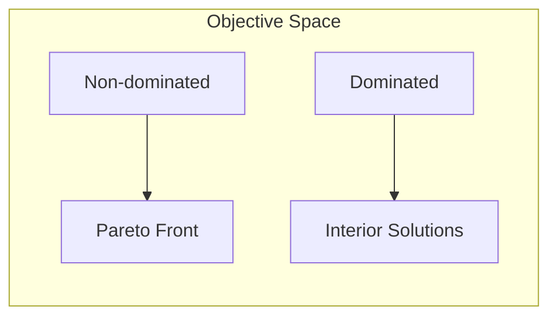

# Multi-Objective Optimization Algorithms

Multi-objective optimization algorithms handle problems with multiple, often conflicting, objectives. They find a set of Pareto-optimal solutions.

## Overview

| Property | Value |
|----------|-------|
| **Category** | Multi-Objective |
| **Algorithms** | 4 |
| **Best For** | Trade-off analysis |
| **Output** | Pareto front |

## Algorithm List

### NSGA-II (Non-dominated Sorting Genetic Algorithm II)

The most widely used multi-objective evolutionary algorithm.

```python
from opt.multi_objective import NSGAII

optimizer = NSGAII(
    func=multi_objective_func,
    lower_bound=-5,
    upper_bound=5,
    dim=10,
    n_objectives=2,
    population_size=100,
    max_iter=200,
)
```

### MOEA/D (Multi-Objective Evolutionary Algorithm based on Decomposition)

Decomposes multi-objective problem into scalar subproblems.

```python
from opt.multi_objective import MOEAD

optimizer = MOEAD(
    func=multi_objective_func,
    lower_bound=-5,
    upper_bound=5,
    dim=10,
    n_objectives=2,
    max_iter=200,
)
```

### Complete Algorithm List

| Algorithm | Approach | Module |
|-----------|----------|--------|
| Abstract Multi-Objective | Base class | `abstract_multi_objective` |
| MOEA/D | Decomposition | `moead` |
| NSGA-II | Non-dominated sorting | `nsga_ii` |
| SPEA2 | Strength Pareto | `spea2` |

## Key Concepts

### Pareto Dominance

Solution A dominates solution B if:

- A is at least as good as B in all objectives
- A is strictly better than B in at least one objective

### Pareto Front



## See Also

- [API Reference: Multi-Objective](../api/multi-objective.md)
