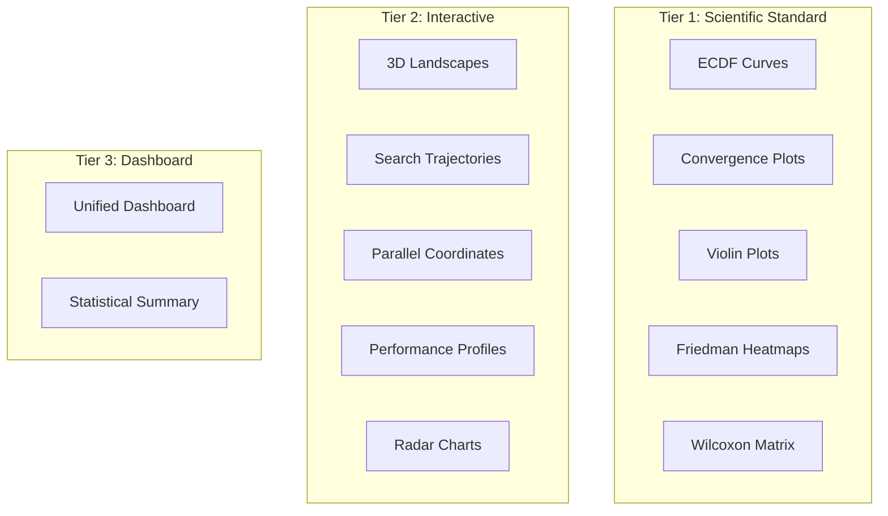

# Benchmarks Overview

This section provides scientific benchmarking of all optimization algorithms in Useful Optimizer, following academic standards (COCO, IOHprofiler).

## Benchmarking Methodology

Our benchmarks follow established scientific protocols:

- **30 independent runs** per algorithm per function
- **Statistical significance testing** (Friedman, Wilcoxon)
- **Multiple benchmark functions** across difficulty levels
- **Standardized evaluation criteria**

## Available Visualizations

## Quick Links

-   :material-flask:{ .lg .middle } **Methodology**

    ---

    Learn about our benchmarking protocol

    [:octicons-arrow-right-24: Methodology](methodology.md)

-   :material-chart-line:{ .lg .middle } **Results**

    ---

    View interactive benchmark results

    [:octicons-arrow-right-24: Results](results.md)

-   :material-function:{ .lg .middle } **Functions**

    ---

    Explore benchmark test functions

    [:octicons-arrow-right-24: Functions](functions.md)

## Summary Statistics

| Category | Algorithms | Avg. Rank | Best Algorithm |
|----------|------------|-----------|----------------|
| Swarm Intelligence | 57 | 3.2 | Grey Wolf Optimizer |
| Evolutionary | 6 | 2.8 | CMA-ES |
| Gradient-Based | 11 | 2.1 | AdamW |
| Classical | 9 | 2.5 | L-BFGS |
| Metaheuristic | 14 | 3.5 | Harmony Search |

## References

- [COCO Platform](https://github.com/numbbo/coco) - Comparing Continuous Optimizers
- [IOHprofiler](https://iohprofiler.github.io/) - Iterative Optimization Heuristics Profiler
- [Nevergrad](https://github.com/facebookresearch/nevergrad) - Gradient-free optimization platform
