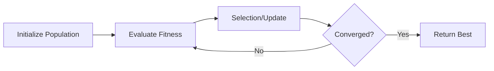
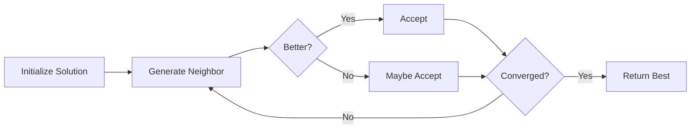

# Basic Concepts

This page introduces the fundamental concepts you'll encounter when working with optimization algorithms.

---

## What is Optimization?

**Optimization** is the process of finding the best solution from a set of possible solutions. In mathematical terms, we seek to find:

\[
\mathbf{x}^* = \arg\min_{\mathbf{x} \in \mathcal{S}} f(\mathbf{x})
\]

Where:

- \( \mathbf{x}^* \) is the optimal solution
- \( f(\mathbf{x}) \) is the **objective function** (also called fitness or cost function)
- \( \mathcal{S} \) is the **search space** (feasible region)

!!! note "Minimization vs Maximization"
    Most algorithms in Useful Optimizer perform **minimization**. To maximize a function \( g(\mathbf{x}) \), simply minimize \( -g(\mathbf{x}) \).

---

## Key Terminology

### Objective Function

The function we want to minimize. It takes a candidate solution and returns a scalar value (the "fitness").

```python
def objective(x):
    """Example: Sphere function."""
    return sum(xi**2 for xi in x)
```

### Search Space

The region where we look for solutions, defined by bounds:

```python
lower_bound = -10  # Minimum value for each dimension
upper_bound = 10   # Maximum value for each dimension
dim = 5            # Number of dimensions
```

### Solution / Candidate

A point in the search space, typically represented as a vector:

```python
import numpy as np
candidate = np.array([1.5, -2.3, 0.7, 4.1, -1.2])  # 5D solution
```

### Fitness Value

The result of evaluating the objective function at a given solution:

```python
fitness = objective(candidate)  # Lower is better for minimization
```

---

## Types of Optimization Problems

### By Search Space

| Type | Description | Example |
|------|-------------|---------|
| **Continuous** | Variables can take any real value | Finding optimal neural network weights |
| **Discrete** | Variables are integers | Selecting which items to include |
| **Combinatorial** | Variables are permutations or sequences | Traveling salesman problem |

!!! info
    Useful Optimizer focuses primarily on **continuous optimization** problems.

### By Objective Function Properties

| Property | Description | Implications |
|----------|-------------|--------------|
| **Convex** | Single global minimum | Gradient methods work well |
| **Multimodal** | Multiple local minima | May need global search methods |
| **Differentiable** | Gradient exists everywhere | Can use gradient-based methods |
| **Non-differentiable** | Has discontinuities or kinks | Need derivative-free methods |

---

## Algorithm Categories

### Population-Based Methods

Maintain a population of candidate solutions that evolve together.



**Examples**: Particle Swarm, Genetic Algorithm, Differential Evolution

**Pros**: Good at avoiding local optima, parallel evaluation possible

**Cons**: Many function evaluations, require tuning population size

### Single-Solution Methods

Iteratively improve a single candidate solution.



**Examples**: Hill Climbing, Simulated Annealing, Tabu Search

**Pros**: Fewer parameters, faster per iteration

**Cons**: May get stuck in local optima

### Gradient-Based Methods

Use derivative information to guide the search.

\[
\mathbf{x}_{t+1} = \mathbf{x}_t - \alpha \nabla f(\mathbf{x}_t)
\]

**Examples**: SGD, Adam, BFGS

**Pros**: Fast convergence for smooth functions

**Cons**: Require differentiable functions, may converge to local optima

---

## Common Parameters

Most optimizers share these parameters:

| Parameter | Description | Typical Values |
|-----------|-------------|----------------|
| `func` | Objective function to minimize | Your function |
| `lower_bound` | Lower boundary of search space | Problem-dependent |
| `upper_bound` | Upper boundary of search space | Problem-dependent |
| `dim` | Number of dimensions | 1-1000+ |
| `max_iter` | Maximum iterations | 100-10000 |
| `population_size` | Number of candidates (population methods) | 20-100 |

---

## Convergence

An algorithm has **converged** when it can no longer make significant progress. This can be due to:

1. **Maximum iterations reached** - Hard limit on computational budget
2. **Fitness threshold** - Solution quality is "good enough"
3. **Stagnation** - No improvement over several iterations
4. **Population convergence** - All candidates are nearly identical

---

## No Free Lunch Theorem

!!! quote "No Free Lunch Theorem (Wolpert & Macready, 1997)"
    Averaged over all possible problems, all optimization algorithms perform equally well.

This means:

- **No single algorithm is best for all problems**
- Algorithm selection depends on problem characteristics
- Experimenting with multiple algorithms is often necessary

---

## Choosing an Algorithm

Consider these factors:

| Factor | Recommendation |
|--------|----------------|
| Smooth, convex function | Gradient-based (BFGS, Adam) |
| Many local optima | Population-based (PSO, DE) or Simulated Annealing |
| High dimensionality | CMA-ES, Differential Evolution |
| Limited function evaluations | Local search (Nelder-Mead) |
| Black-box function | Derivative-free methods |

---

## Next Steps

- Explore the [Algorithm Documentation](../algorithms/index.md) to learn about specific optimizers
- Try different algorithms on [Benchmark Functions](../benchmarks/functions.md)
- Check the [API Reference](../api/index.md) for detailed parameter descriptions
