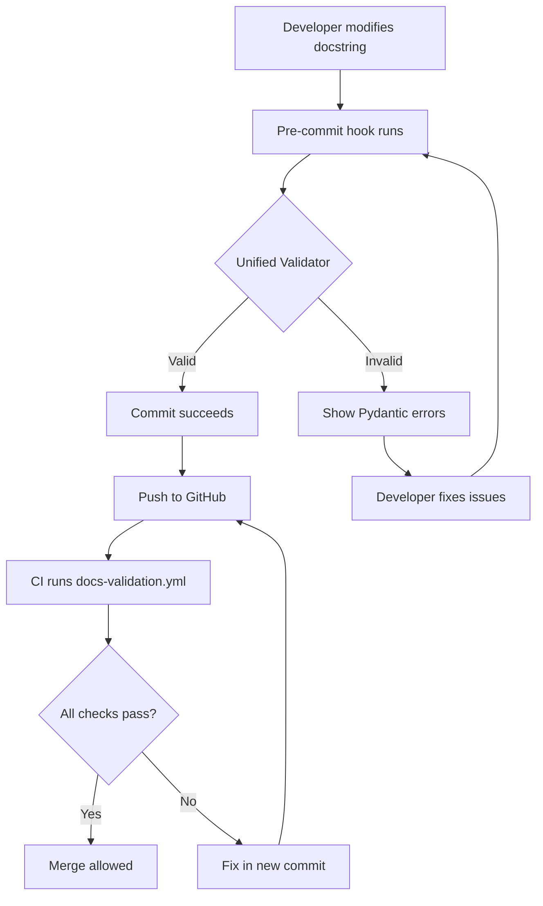

# Scripts Documentation

This directory contains validation and generation scripts for the useful-optimizer library.

## 🎯 Schema-Driven Documentation Pipeline

The project uses a **unified, schema-driven documentation pipeline** with Pydantic models for type-safe validation:

```
┌─────────────────────────────────────────────────────────────────┐
│              Schema-Driven Validation Pipeline                  │
├─────────────────────────────────────────────────────────────────┤
│                                                                 │
│  docs/schemas/          scripts/              scripts/          │
│  ┌────────────────┐    ┌─────────────────┐   ┌──────────────┐  │
│  │ docstring-     │───▶│ docstring_      │──▶│ unified_     │  │
│  │ schema.json    │    │ models.py       │   │ validator.py │  │
│  │                │    │ (Pydantic)      │   │              │  │
│  └────────────────┘    └─────────────────┘   └──────────────┘  │
│                             │                        │          │
│                             │                        ▼          │
│                             │                  Pre-commit       │
│                             │                  CI/CD            │
│                             ▼                                   │
│                        Type-safe                                │
│                        Validation                               │
└─────────────────────────────────────────────────────────────────┘
```

### Core Components

1. **JSON Schema** (`docs/schemas/docstring-schema.json`)
   - Single source of truth for docstring structure
   - Defines COCO/BBOB template requirements
   - 722 lines defining metadata, args, attributes, etc.

2. **Pydantic Models** (`scripts/docstring_models.py`)
   - Generated from JSON schema using `datamodel-code-generator`
   - Type-safe Python models for validation
   - Includes: `COCOBBOBOptimizerDocstringSchema`, `AlgorithmMetadata`, etc.
   - **Note**: Pydantic and jsonschema are optional dependencies in `[dependency-groups]` validate group

3. **DocstringParser** (`scripts/docstring_parser.py`)
   - Extracts docstrings from Python files
   - Parses sections (Algorithm Metadata, Args, etc.)
   - Validates against Pydantic models

4. **Unified Validator** (`scripts/unified_validator.py`)
   - CLI tool for validating optimizer docstrings
   - Replaces regex-based validators
   - Provides detailed Pydantic validation errors

### Installation

```bash
# Install core dependencies (numpy, scipy, scikit-learn)
uv sync

# Install code hygiene and validation tools (includes Pydantic and jsonschema)
uv sync --group validate
```

### Quick Start

```bash
# Validate a single file
uv run python scripts/unified_validator.py opt/classical/simulated_annealing.py -v

# Validate all optimizer files
uv run python scripts/unified_validator.py --all

# Test the parser
uv run python scripts/docstring_parser.py opt/swarm_intelligence/particle_swarm.py
```

### Testing

```bash
# Run Pydantic model tests
uv run pytest scripts/test/test_docstring_models.py -v

# Run parser tests
uv run pytest scripts/test/test_docstring_parser.py -v

# Run all script tests
uv run pytest scripts/test/ -v
```

### Pre-Commit Hooks

The schema-driven validation is integrated with pre-commit hooks:

```bash
# Install pre-commit hooks
uv run pre-commit install

# Run unified validator hook
uv run pre-commit run unified-docstring-validator --all-files

# Run Google docstring inline summaries hook
uv run pre-commit run google-docstring-inline-summaries --all-files

# Run all hooks
uv run pre-commit run --all-files
```

### CI/CD Integration

The `.github/workflows/docs-validation.yml` workflow automatically validates:
- All optimizer docstrings against Pydantic schema
- JSON schema files are valid JSON
- JSON schemas are valid JSON Schema Draft 7
- Pydantic models can be imported successfully

### Extending the Schema

To add new fields or modify the schema:

1. **Update JSON Schema** (`docs/schemas/docstring-schema.json`):
   ```json
   {
     "properties": {
       "new_field": {
         "type": "string",
         "description": "Description of the new field"
       }
     }
   }
   ```

2. **Regenerate Pydantic Models** (if using datamodel-code-generator):
   ```bash
   uv run datamodel-codegen \
     --input docs/schemas/docstring-schema.json \
     --output scripts/docstring_models.py \
     --output-model-type pydantic_v2.BaseModel
   ```

   **Note**: Current models were manually created for better control. Consider manual updates for small changes.

3. **Update DocstringParser** if needed:
   - Add parsing logic for new sections in `scripts/docstring_parser.py`
   - Update the `parse_file()` method to extract the new field

4. **Update Tests**:
   - Add test cases in `scripts/test/test_docstring_models.py`
   - Verify parsing in `scripts/test/test_docstring_parser.py`

5. **Validate Changes**:
   ```bash
   # Validate schema is valid JSON Schema Draft 7
   uv run python -c "
   import json
   from jsonschema import Draft7Validator
   with open('docs/schemas/docstring-schema.json') as f:
       schema = json.load(f)
   Draft7Validator.check_schema(schema)
   print('✓ Schema is valid')
   "

   # Test updated models
   uv run pytest scripts/test/ -v

   # Test on real files
   uv run python scripts/unified_validator.py opt/classical/simulated_annealing.py -v
   ```

### Schema Validation Workflow



## Available Scripts

### 1. `batch_update_docstrings.py` - Docstring Template Generator

Automates the generation of COCO/BBOB-compliant docstring templates for all optimizer classes.

## Features

- ✅ **AST Parsing**: Extracts class names, parameters, and existing docstrings using Python's AST module
- ✅ **Template Generation**: Generates COCO/BBOB-compliant templates with FIXME markers for manual completion
- ✅ **Category Detection**: Auto-detects optimizer category from directory structure
- ✅ **Skip Abstract Classes**: Automatically excludes `abstract_*.py` files
- ✅ **Dry Run Mode**: Preview changes before writing to files
- ✅ **File Writing**: Automatically writes generated templates to optimizer files (when not in dry-run mode)
- ✅ **Multi-Objective Support**: Handles both single-objective and multi-objective optimizers
- ✅ **High Performance**: Processes 117 files in ~0.15 seconds

## Usage

### Basic Commands

```bash
# Preview changes for all optimizers (recommended first step)
uv run python scripts/batch_update_docstrings.py --dry-run

# Process specific category only
uv run python scripts/batch_update_docstrings.py --category swarm_intelligence

# Process all optimizers (writes templates to files - CAUTION!)
uv run python scripts/batch_update_docstrings.py

# Show help
uv run python scripts/batch_update_docstrings.py --help
```

### Command-Line Options

- `--dry-run`: Preview changes without writing to files (recommended for first run)
- `--category {category}`: Process only the specified category
  - Available categories: `classical`, `constrained`, `evolutionary`, `gradient_based`, `metaheuristic`, `multi_objective`, `physics_inspired`, `probabilistic`, `social_inspired`, `swarm_intelligence`

## Output Example

```
🔍 Found 117 optimizer files to process

📝 Generated BBOB template for ParticleSwarm
   File: opt/swarm_intelligence/particle_swarm.py
   Category: swarm_intelligence
   Parameters: func, lower_bound, upper_bound, dim, population_size, max_iter, seed
   Action: ✅ Docstring template written to file
   ⚠️  Note: Review and complete FIXME markers in the generated template.
   ⚠️  Note: This is a template. Manual review and completion needed.

...

======================================================================
✅ Successfully processed 117 optimizer files

📊 Summary:
   Total files scanned: 117
   Successfully processed: 117
   Failed: 0

⚠️  Templates generated with FIXME markers. Manual review required!
   See .github/prompts/optimizer-docs-template.prompt.md for guidance.
```

## Implementation Details

### How It Works

1. **File Discovery**: Scans optimizer directories and finds all Python files
2. **AST Parsing**: Uses Python's `ast` module to extract:
   - Class names
   - Base classes (AbstractOptimizer or AbstractMultiObjectiveOptimizer)
   - `__init__` parameters
   - Existing docstrings
3. **Category Detection**: Extracts category from parent directory name
4. **Template Generation**: Creates COCO/BBOB-compliant templates with:
   - 11 required sections (Algorithm Metadata, Mathematical Formulation, etc.)
   - FIXME markers for manual completion
   - Algorithm-specific parameter listings
   - Proper return types for single/multi-objective optimizers
5. **Output**: Displays processing results with actionable information

### Key Functions

- `extract_optimizer_info(filepath)`: Parse file with AST and extract class information
- `generate_bbob_docstring_template(info)`: Create compliant template with FIXME markers
- `find_optimizer_files(base_path, category)`: Locate all optimizer files to process
- `process_optimizer(filepath, dry_run)`: Process a single optimizer file
- `main(argv)`: Entry point that orchestrates the batch processing

### File Structure

```
scripts/
  ├── batch_update_docstrings.py                    # Main docstring template generator
  ├── check_google_docstring_inline_descriptions.py # Enforce Google-style inline parameter descriptions
  ├── validate_optimizer_docs.py                    # Validate COCO/BBOB compliance
  └── generate_docs.py                              # VitePress documentation generator
opt/
  ├── classical/                     # 9 optimizers
  ├── constrained/                   # 5 optimizers
  ├── evolutionary/                  # 6 optimizers
  ├── gradient_based/                # 11 optimizers
  ├── metaheuristic/                 # 14 optimizers
  ├── multi_objective/               # 3 optimizers
  ├── physics_inspired/              # 4 optimizers
  ├── probabilistic/                 # 5 optimizers
  ├── social_inspired/               # 4 optimizers
  └── swarm_intelligence/            # 56 optimizers
  └── test/
      └── test_batch_update_docstrings.py  # Comprehensive tests
```

## Template Sections

The script generates templates with all 11 COCO/BBOB-required sections:

1. **Algorithm Metadata**: Name, acronym, year, authors, class, complexity, properties
2. **Mathematical Formulation**: Core equations, constraint handling
3. **Hyperparameters**: Default values, BBOB recommendations, sensitivity analysis
4. **COCO/BBOB Benchmark Settings**: Search space, evaluation budget, performance metrics
5. **Example**: Working doctest examples with `seed=42`
6. **Args**: All parameters with BBOB guidance
7. **Attributes**: All instance variables including `self.seed`
8. **Methods**: `search()` method signature and documentation
9. **References**: Citations with DOI and COCO data archive links
10. **See Also**: Related algorithms with BBOB comparisons
11. **Notes**: Complexity, performance characteristics, convergence properties, reproducibility

## FIXME Markers

The script adds FIXME markers for sections that require manual completion:

- Algorithm name, acronym, year, authors
- Mathematical formulation equations
- Hyperparameter tables and sensitivity analysis
- Algorithm-specific parameters
- Performance characteristics
- References and citations
- Related algorithms

## Testing

The script includes comprehensive test coverage:

```bash
# Run all tests
uv run pytest opt/test/test_batch_update_docstrings.py -v

# Test coverage includes:
# - AST parsing (basic and multi-objective)
# - Template generation
# - File discovery
# - Real optimizer extraction
# - BBOB compliance verification
```

## Performance

- **Processing Time**: ~0.157 seconds for 117 files
- **Throughput**: ~745 files/second
- **Performance Target**: < 5 seconds ✅ (31x faster than requirement)

## Next Steps After Running Script

1. Review the generated templates with FIXME markers in the modified optimizer files
2. Complete algorithm-specific information:
   - Fill in metadata (year, authors, acronym)
   - Add mathematical formulation
   - Document hyperparameters
   - Add performance characteristics
   - Include references
3. Validate generated docstrings:
   - Run doctests: `uv run python -m doctest opt/[category]/[module].py`
   - Verify formatting: `uv run ruff check opt/`
4. Refer to `.github/prompts/optimizer-docs-template.prompt.md` for detailed guidance

**Note:** The script writes templates directly to optimizer files when run without `--dry-run`.
Always use `--dry-run` first to preview changes before applying them to avoid accidental overwrites.

## Troubleshooting

### Common Issues

**Issue**: Script can't find opt directory
**Solution**: Run from repository root: `cd /path/to/useful-optimizer`

**Issue**: Import errors
**Solution**: Ensure virtual environment is activated: `uv sync`

**Issue**: AST parsing fails for a file
**Solution**: Check file for syntax errors: `uv run python -m py_compile opt/[category]/[file].py`

## Dependencies

- Python 3.10+
- Standard library only (no external dependencies)
  - `ast`: AST parsing
  - `argparse`: Command-line interface
  - `pathlib`: File path handling
  - `sys`: System utilities

## Contributing

When modifying the script:

1. Update tests in `opt/test/test_batch_update_docstrings.py`
2. Run linter: `uv run ruff check scripts/batch_update_docstrings.py`
3. Verify performance: `time uv run python scripts/batch_update_docstrings.py --dry-run`
4. Test on real optimizers: `uv run python scripts/batch_update_docstrings.py --category classical --dry-run`

## Related Documentation

- [COCO/BBOB Template](../.github/prompts/optimizer-docs-template.prompt.md): Complete docstring template guide
- [Google Python Style Guide](https://google.github.io/styleguide/pyguide.html#383-functions-and-methods): Official docstring formatting guidelines
- [Copilot Instructions](../.github/copilot-instructions.md): Comprehensive project development guidelines

---

## 2. `check_google_docstring_inline_descriptions.py` - Google Style Validator

Enforces Google-style docstring formatting by ensuring parameter descriptions start on the same line as the parameter name.

### Purpose

This script prevents the common mistake of adding line breaks between parameter names and their descriptions, which violates the official Google Python Style Guide.

### What It Checks

**✅ CORRECT** (parameter description on same line):
```python
Args:
    func (Callable[[ndarray], float]): Objective function to minimize.
    lower_bound (float): Lower bound of search space.
```

**❌ WRONG** (line break after parameter name):
```python
Args:
    func (Callable[[ndarray], float]):
        Objective function to minimize.
    lower_bound (float):
        Lower bound of search space.
```

### Usage

The script is automatically run by pre-commit hooks on all optimizer files:

```bash
# Run manually on specific files
python scripts/check_google_docstring_inline_descriptions.py opt/swarm_intelligence/particle_swarm.py

# Run via pre-commit (recommended)
pre-commit run google-docstring-inline-summaries --all-files
```

### Pre-Commit Integration

Configured in `.pre-commit-config.yaml` to run on:
- `opt/abstract_optimizer.py`
- `opt/multi_objective/abstract_multi_objective.py`
- All optimizer files in: `classical/`, `constrained/`, `evolutionary/`, `gradient_based/`, `metaheuristic/`, `multi_objective/`, `physics_inspired/`, `probabilistic/`, `social_inspired/`, `swarm_intelligence/`

Excludes: `benchmark/`, `test/`, `__pycache__/`, `visualization/`

### Error Messages

```
opt/swarm_intelligence/particle_swarm.py:45: Docstring entry missing inline summary after type: func (Callable[[ndarray], float]):
```

### How to Fix

Move the description to the same line as the parameter:

```python
# Before (WRONG)
    func (Callable[[ndarray], float]):
        Objective function to minimize.

# After (CORRECT)
    func (Callable[[ndarray], float]): Objective function to minimize.
```

For long descriptions, continue on the next line with proper indentation:

```python
    parameter2 (str): This is a longer definition. I need to include so much
        information that it needs a second line. Notice the indentation.
```

### References

- **Google Python Style Guide**: https://google.github.io/styleguide/pyguide.html#383-functions-and-methods
- **PEP 257**: https://peps.python.org/pep-0257/
- **Sphinx Napoleon**: https://www.sphinx-doc.org/en/master/usage/extensions/napoleon.html

---

## 3. `validate_optimizer_docs.py` - COCO/BBOB Compliance Validator

Validates optimizer docstrings for COCO/BBOB scientific benchmarking compliance (see issue [#110](https://github.com/Anselmoo/useful-optimizer/issues/110)).

---

## 4. `generate_docs.py` - VitePress Documentation Generator

Generates VitePress documentation pages from optimizer source code.
- [COCO Platform](https://coco-platform.org/): Official COCO/BBOB documentation
- [BBOB Test Suite](https://coco-platform.org/testsuites/bbob/overview.html): Benchmark suite overview

## License

MIT License - See repository root for details.
